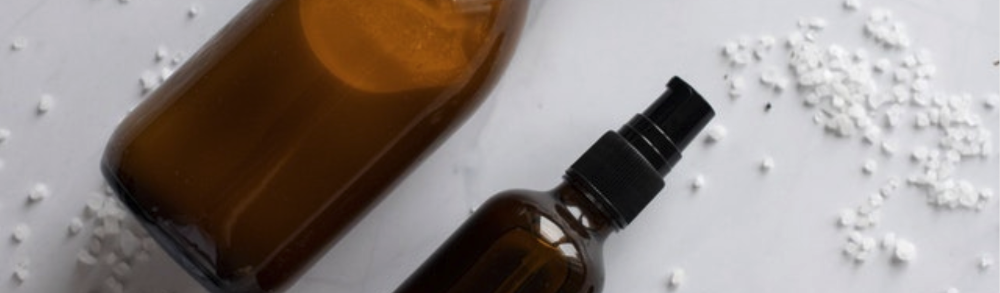

# Skinwareness

Skinwareness is a website that provides useful information on skincare making. The aim of the site is to educate people on proper skincare making techniques, ingredients and best practices in order to create safe, professional and high quality products. 

The last number of years has seen a rise in DIY skincare with more people wanting more control over the products they use and transparency over ingredients used in their products. This has allowed people to not only create products that are free from harsh chemicals and ingredients but also environmentally friendly and sustanable. This unfortunately has also lead to mass amounts of misinformation online and harmful recipes floating around the internet. 

This site allows people to avoid the common pitfuls that arise when skincare making and provide simplified and factual information.  

# Features

## Features common on all pages

### Header
- The header element sticks to the top of the page as the user scrolls down.
- This give users quick access to the navigations to allow for a better user experience.
- The header element contains the logo and the navigation bar.

#### Logo
- The logo showcases the sites name in large black writing. 

#### Navigation bar
- The navigation bar has a hover function that changes the navigation color to black with a white text and rounded border which follows the clean aestethic of the site.
- It links to the home page, product types page, ingredients index page and best practice page.
- It apears on all four pages.

### Hero Images
- Each page has its own hero image.
- Each pages respective hero image aims to reflect the pages content.

#### Home page - Hero Image
- The home page hero image shows a woman applying skincare.
- The image aims to indicate to the user that the site they have entered revolves around skincare.

#### Product Types page - Hero Image
- The hero image shows cosmetic products in brown bottles.

#### Ingredients Index page - Hero Image
- The hero image shows a range of ingredients layed out on a table.

#### Best Practice page - Hero Image
- The hero image shows a person wearing gloves mixing products together.

### Newsletter
- A sign up form that allows people to subscribe to the newsletter and get new skincare making tips to their inbox.
- It has an accent brown colour that follows the clean neutral aesthetic of the site.

### Footer
- Links to social media.
- Hover feature with colour that accent colour as seen in the introduction section, diy skincare section and newsletter section.
- Directs user to the respective site on a new page.

## Features page content

### Home page

#### Welcome to Skinwareness
- The welcome section introduces user to the website. 
- It mentions why the site was created and what users can expect to find on the site.
- It has an image of a girl with her eyes closed facing the sun.
- It text is highlighted by the brown accent colour.

#### DIY Skincare
- The DIY skincare section talks about the rise in diy skincare and the danger it faces which is the main reason for the sites creation.
- It has an image of skincare products in brown glass containers.
- Just like the welcome section the text is highlighted by the brown accents colour.

#### Resources
- The resources section links to the other pages on the website, with a learn more button.
- Each resource link is backed by images that represent the pages and also feature as hero images on each page. 
- The links have a hover function that changes the learn more button color to black and white.

### Product Types page
- The products types page starts with an introduction into the different types of cosmetic products.
- It then goes into each of the 3 cosmetic products oil, water and emulsion.
- Each product type section is accompanied by a respective image that show cases the different product types.

### Ingredients Index page
- The ingredients index page splits up the the ingredients by three categories.
- Each category, plant oil, butters and waxes talks about the different categories and gives examples of the specific ingredients used in skincare.
- Each category is also accompanied by a respective image highlighting them.

 

### Best Practice page
- The best practice page starts with an introduction, before you begin section. 
- The introduction highlihgts personla hygiene and types of equipment used. 
- It then goes into different sections that highlight essential oil safety, packaging and storage and finally product quality. 
- Each section is accompanied by a respective image highlighting each section. 

# Testing

## Responsive Design

I found it quite difficult to adjust the site for responsive design. I found that it would have been a much smoother experience if I had opted for a mobile first approach, which is something I will make sure to do in the future. For the layout of the page contents I used flex box for the display, which I found very difficult to adjust when it came to the responsive design. For my responsive design I changed my display to block which made it alot easier for me to stack the content on top of each other. I also changed the width of the contents to 100% so they would take up the full width of the screen on mobile display.

For the medium to large screen sizes I found some issues with overlapping content so I targeted those specific areas at the specific widths that were giving issues. Between the large screen size and the medium screen size 768px to 900px I targeted those specific widths to adjust the navigation bar which didn't fit into the header. I also adjusted the welcome content, removing the full width so the content stayed within its container.

I also found issue with certain sections of the site at certain widths which I had to make specified adjustments for. The resources section text overflowed at a certain width so I decreased the font size and increased the size of the container between 769px to 958px. The main content of the product types page also overflowed into each section so I removed the padding, increased the content width and added a margin within 769px to 875px. Making these changes allowed there be a smoother responsiveness as the site went from large screen, to medium, to small.

## Validator Testing

### HTML
All together two warnings and an error message were highlighted when all the pages were put into the HTML checker. The first warning highlighted that the section element with the hero image lacked a heading. This error was present in all pages. The solution I made for this was to..... The error message The second warning highlighted that there was no space between an aria-label attribute in the footer. This error was also present on all pages. My solution to fix this was to simply add a space within the attribute. The second warning highlighted to consider using the h1 element as a top level heading only. This warning was present in the product types page and the best practice page. My solution here was to change the h1 element to h2. 

#### Index page
when I ran my index page code through the html tracker a warning and an error came up. The warning highlighted that my section element with my hero image lacked a heading and the error highlighted that there was no space between my aria-label attribute. For my solution I added in a space between the attribute

#### Product types page
The HTML checker highlighted two warnings and one error. It had the same warning and error for the hero image section heading and space between the attribute as the index page. It's second warning highlighted to consider using the h1 element as a top level heading only. I followed the same solution for the attribute spacing and I changed the h1 class for the page title to h2.

#### Ingredients Index page
The HTML checker highlighted that the page had the same warning and error message as the index page. I used the same solution as I did for the index page.

#### Best Practice page

## File Paths

..........

## Navigation Bar 

............

## Form Alignment

..........

- ..........

- .........

............

## Footer

........

## validation

- .......

- ........

- ........

- .......

...........

# Unfixed Bugs

## Navigation and links

.........

# deployment

...........

# credits

## content

- Font was sourced from Google Fonts https://fonts.google.com/

- Icons were sourced from Font Awesome https://fontawesome.com/

## media

- All pictures were taken from the open source site Pexels https://www.pexels.com/

## code

- semi transparent layer over images - https://stackoverflow.com/questions/9182978/semi-transparent-color-layer-over-background-image
- css flexbox - https://www.youtube.com/watch?v=_HTL0XSMcRQ&list=LL&index=3&t=609s